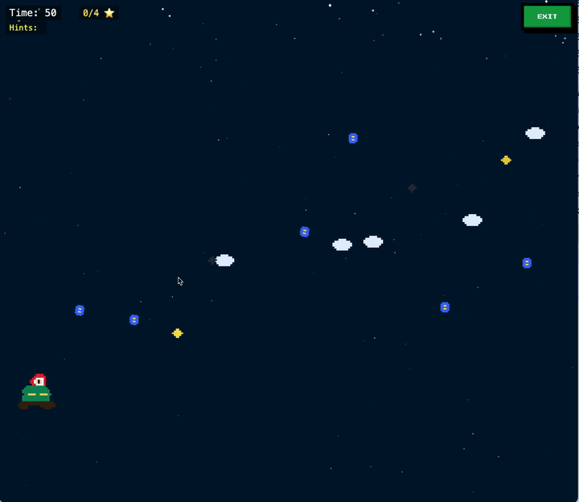
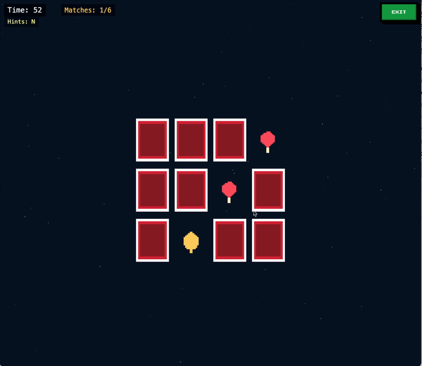
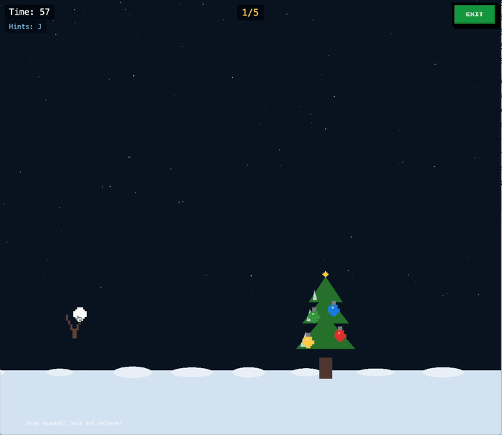
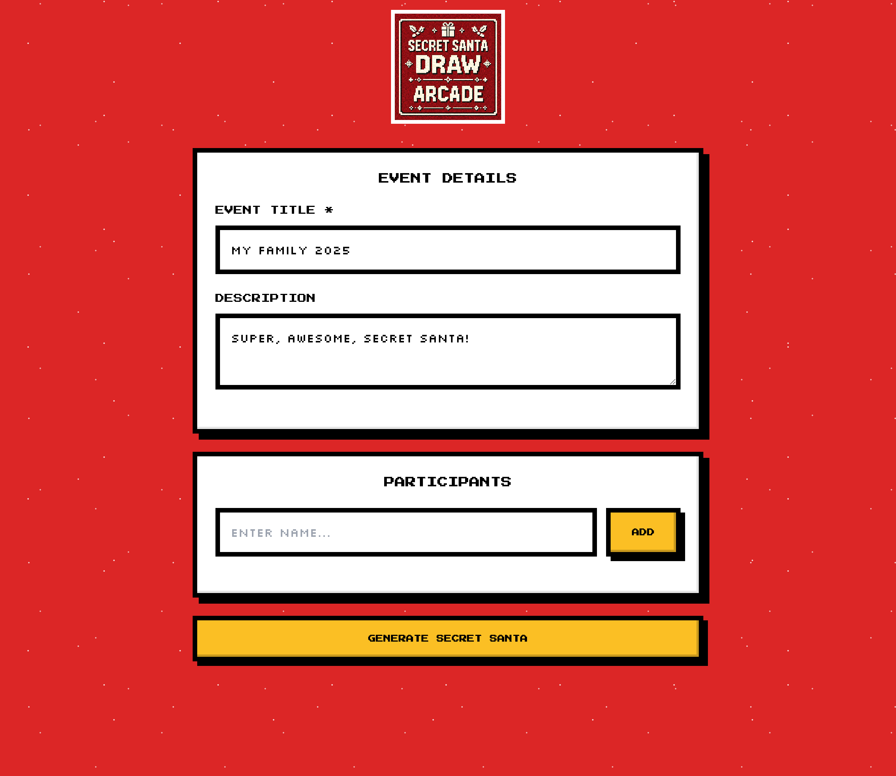
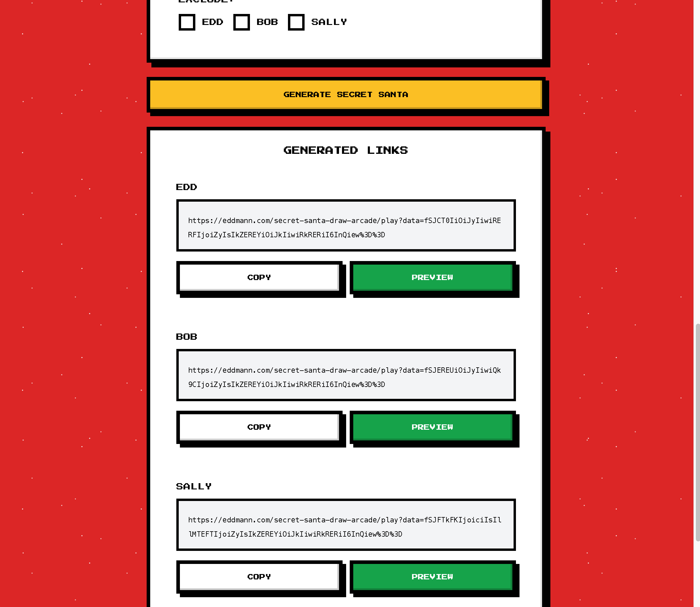

<div align="center">
  

[Live Demo](https://eddmann.com/secret-santa-draw-arcade/)

</div>

# 🎮 Secret Santa Draw Arcade

_Because why just draw names when you can earn them through retro arcade games?_

Every year I over-engineer our family's Secret Santa allocation. This year: retro arcade games built with Phaser.js. Participants play a randomly selected Christmas mini-game to unlock their Secret Santa assignment. No backend, no accounts, just pure client-side gaming fun.

**Tech Stack:** React, TypeScript, Phaser.js, Bun

## 🚀 Getting Started

```bash
bun install
bun dev    # Start development server
bun build  # Build for production
```

## 🎯 The Games

Each participant gets a random game challenge. Complete the challenge to reveal your Secret Santa recipient letter by letter!

|                                                                 |                                                                                                                                               |
| :-------------------------------------------------------------: | :-------------------------------------------------------------------------------------------------------------------------------------------- |
|              | **[Santa Maze](src/game/SantaMazeGame.ts)**<br>Navigate a peppermint maze, collect 3 ornaments, then reach the present                        |
|  | **[Reindeer Delivery Dash](src/game/ReindeerDeliveryGame.ts)**<br>Fly Santa's sleigh through the sky, collect 4 stars while dodging obstacles |
|     | **[Stocking Fill Match](src/game/StockingMatchGame.ts)**<br>Memory game: match 6 pairs of holiday icons                                       |
|    | **[Gift Stack Challenge](src/game/GiftStackingGame.ts)**<br>Balance and stack 6 falling gifts on a moving platform                            |
|      | **[Snowball Slingshot](src/game/SnowballSlingshotGame.ts)**<br>Aim and launch snowballs to knock 5 ornaments off the Christmas tree           |

## 📖 How It Works

1. Create your event and add participants
2. Set any exclusions (e.g., couples shouldn't get each other)
3. Generate unique game links for each participant
4. Share the links - each person plays their game to reveal their match

|              Event Creation              |              Generated Links              |
| :--------------------------------------: | :---------------------------------------: |
|  |  |

The allocation algorithm ensures valid pairings while respecting exclusions. All data is encoded in the URL, so there's no backend or database needed.

## Previous Years

This is part of my annual tradition of over-engineering Secret Santa:

- [2020 - Clojure Secret Santa](https://github.com/eddmann/clojure-secret-santa)
- [2021 - Pico Secret Santa](https://github.com/eddmann/pico-secret-santa)
- [2022 - Step Function Secret Santa](https://github.com/eddmann/step-function-secret-santa)
- [2023 - Secret Santa PWA](https://github.com/eddmann/secret-santa-pwa)
- [2024 - Secret Santa Draw](https://github.com/eddmann/secret-santa-draw)
- **2025 - Secret Santa Draw Arcade** ⭐

## 📄 License

MIT
